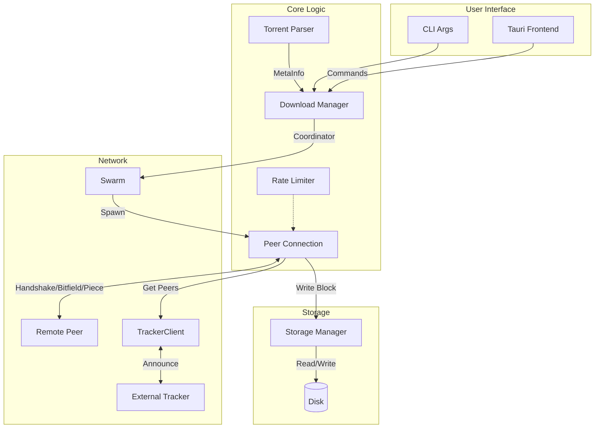
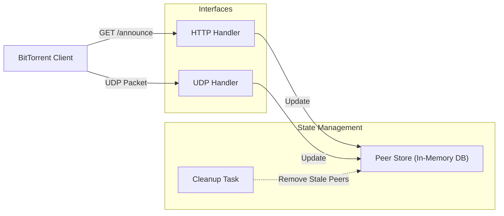
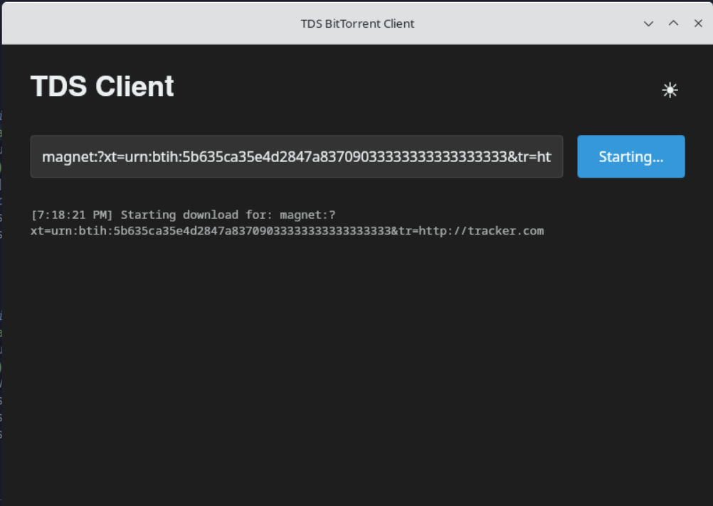
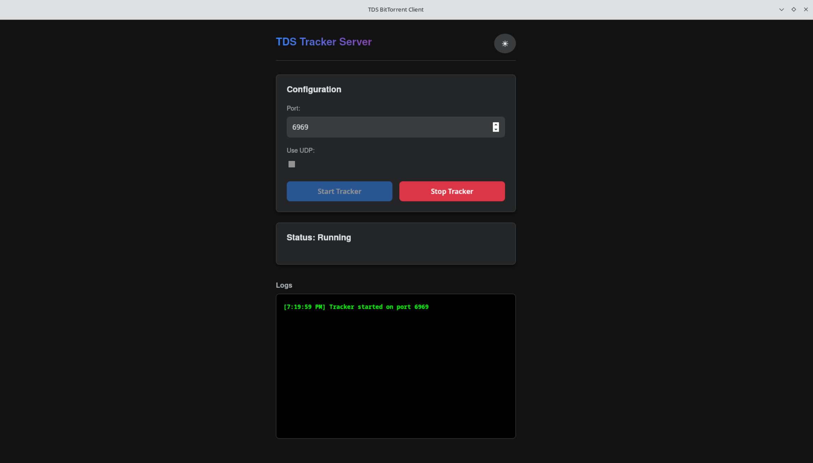

# TDS BitTorrent Ecosystem

A robust, high-performance BitTorrent implementation tailored for learning and extendability. The ecosystem allows you to not only download files using the standard protocol but also host your own tracker server to coordinate peer discovery.

This project is written in **Rust** to enforce memory safety and leverage async concurrency for network operations. It features both Command Line Interfaces (CLI) for headless operations and modern Desktop GUIs built with **Tauri**.

---

## Core Concepts

If you are new to the BitTorrent protocol, here is a brief overview of the concepts implemented in this project:

### 1. The Torrent Metadata

A `.torrent` file contains metadata about the files to be shared (names, sizes, folder structure) and the **integrity hashes** of each piece of data. It serves as a blueprint for the download.

- **Info Hash**: A unique SHA-1 identifier calculated from the metadata. This hash allows peers to verify they are talking about the same content.
- **Bencoding**: A binary-text encoding format used by BitTorrent to serialize complex data structures (dictionaries, lists, integers, byte strings).

### 2. The Tracker (Signaling Server)

The **Tracker** is a special HTTP or UDP server that coordinates communication. It does **not** transfer file data.

- **Role**: It acts as an introducer. Peers "announce" their presence to the tracker.
- **Swarm**: The tracker maintains a list of all peers currently sharing a specific torrent (the "swarm").
- **Response**: When a client requests peers, the tracker returns a list of IP addresses and ports of other clients in the swarm.

### 3. The Client (Peer)

The **Client** is the software that downloads and uploads data.

- **Leecher**: A client that is currently downloading the file.
- **Seeder**: A client that has the complete file and is uploading it to others.
- **Peer Wire Protocol**: Clients connect directly to each other via TCP to exchange data pieces using a requested-based mechanism (Choke/Unchoke, Interested/Not Interested).

### 4. Distributed Hash Table (DHT) & Magnet Links

**Magnet Links** allow downloading without a `.torrent` file. They contain only the **Info Hash**.

- The client uses the **DHT** (a decentralized network of peers) to find other peers who have the metadata for that Info Hash.
- Once the metadata is retrieved from the swarm, the regular download begins.

---

## Project Structure

The workspace is organized into modular components to separate concern and maximize reusability:

- **`tds_core`**: The foundational library. It handles:
  - Bencoding (parsing and generating BitTorrent data structures).
  - SHA-1 hashing and info-hash generation.
  - `.torrent` file parsing and validation.
  - Rate limiting logic (Token Bucket algorithm).
- **`client`**: The reference BitTorrent downloader implementation.
  - Handles the TCP Peer Wire Protocol (Handshake, Choke/Unchoke, Piece requests).
  - Manages file storage and piece assembly.
  - Supports Magnet links via DHT (Distributed Hash Table) bootstrap.
- **`tracker`**: A lightweight BitTorrent Tracker server.
  - Supports HTTP and UDP announce protocols.
  - Maintains an in-memory database of active swarms and peers.
  - Handles peer expiration and cleanup.
- **`tauri-ui`**: A cross-platform desktop GUI for the Client.
  - Visualizes download progress, speed, and peer connections.
- **`tracker-ui`**: A desktop GUI for the Tracker Server.
  - Provides a control panel to start/stop the server and view active logs.

---

## System Architecture

### 1. Client Architecture

The client operates as an asynchronous event loop, coordinating network I/O with disk operations.



### 2. Tracker Architecture

The tracker acts as a centralized signaling server, storing peer information to help clients find each other.



---

## Getting Started: CLI

Ensure you have Rust and Cargo installed via [rustup.rs](https://rustup.rs/).

### Running the Downloader (Headless)

The CLI client supports both `.torrent` files and Magnet links.

```bash
# Basic usage with a torrent file
cargo run -p client -- --torrent path/to/file.torrent --output ./downloads

# Handling a Magnet link
cargo run -p client -- --torrent "magnet:?xt=urn:btih:..."
```

### Running the Tracker (Headless)

The tracker runs by default on port `6969`.

```bash
# Start the tracker server
cargo run -p tracker
```

---

## Getting Started: Graphical User Interface

The project includes modern interfaces for users who prefer visual management. Since these are Tauri apps, you need `Node.js` and `npm` installed (for the frontend) and Rust (for the backend).

### 1. TDS Client UI

The client UI serves as the control center for your downloads. It allows you to paste magnet links, view pieces as they are downloaded, and monitor your connection speed.

**Prerequisites:**

- Install frontend dependencies: `cd tauri-ui && npm install`

**Running Development Mode:**

```bash
cd tauri-ui
npm run tauri dev
```



### 2. TDS Tracker UI

The tracker UI provides a dashboard for server administrators. It allows you to toggle the server on/off, change the port, and view live logs of peers connecting to your tracker.

**Prerequisites:**

- Install frontend dependencies: `cd tracker-ui && npm install`

**Running Development Mode:**

```bash
cd tracker-ui
npm run tauri dev
```



---

## Contributing

We welcome contributions! The project is structured to allow independent development of the core logic, backend servers, and frontends.

### Directory Layout

- **Logic**: `/tds_core` - If you want to improve bencoding performance or parsing logic, work here.
- **Backend**: `/client` and `/tracker` - If you want to improve network protocols or connection handling.
- **Frontend**: `/tauri-ui` and `/tracker-ui` - If you want to improve the look and feel (React/Vite).

### Testing Your Changes

Before submitting a PR, please ensure all tests pass. We use a workspace-wide test command:

```bash
# Run all unit tests across the workspace
cargo test --workspace
```

### Async Development

This project relies heavily on `tokio` for asynchronous runtime.

- **UI State**: When working on UIs, we use `tauri::State` with `tokio::sync::Mutex` to manage shared resources (like the `Downloader` or `TrackerServer`). Never block the main thread!
- **Channels**: We use `tokio::sync::mpsc` for communication between the UI thread and the download workers.

Happy Coding!
